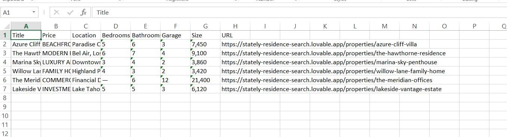
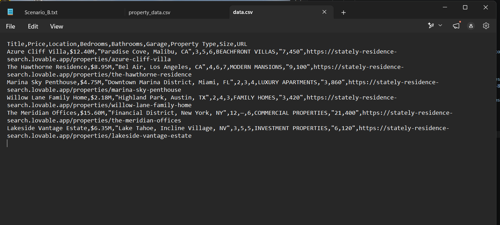

# Real Estate Property Scraper

A Python web scraper built with Playwright that automatically extracts property listings from [Luxe Estate](https://stately-residence-search.lovable.app) and exports the results into Excel and CSV formats for easy analysis.

## Overview

This project visits each property listing page, extracts key details, and saves the results into structured spreadsheet files,built to demonstrate practical experience in browser automation and data extraction for real-world scraping tasks.

## Features

- Scrapes all available property listings on the site
- Collects:
  - Property Title
  - Price
  - Location
  - Bedrooms, Bathrooms, Garage
  - Property Type
  - Size (sqft)
  - Property URL
- Saves data into both Excel (`.xlsx`) and CSV formats
- Handles errors gracefully without stopping the entire scraping process

## Tech Stack

- Python
- Playwright
- openpyxl
- CSV / Regular Expressions (re)

## Installation

Clone the repository:

```bash
git clone https://github.com/Peruzcodx/real-estate-scraper.git
cd real-estate-scraper
```

Install the required packages:

```bash
pip install -r requirements.txt
```

Install the Playwright browser:

```bash
playwright install
```

## How to Run

```bash
python scraper.py
```

The scraper will generate `properties.xlsx` and `properties.csv` in the project folder.

## Sample Output




## Live Demo Site

https://stately-residence-search.lovable.app

## Purpose

This project was built to demonstrate practical experience in:

- Web Scraping
- Browser Automation
- Data Extraction
- Spreadsheet Report Generation
- Python Automation

## Disclaimer

This project targets a demo/sandbox site and is intended for educational and portfolio purposes. Always review and comply with a website's Terms of Service and robots.txt before scraping production sites.

## Author

Peter | [github.com/Peruzcodx](https://github.com/Peruzcodx)
